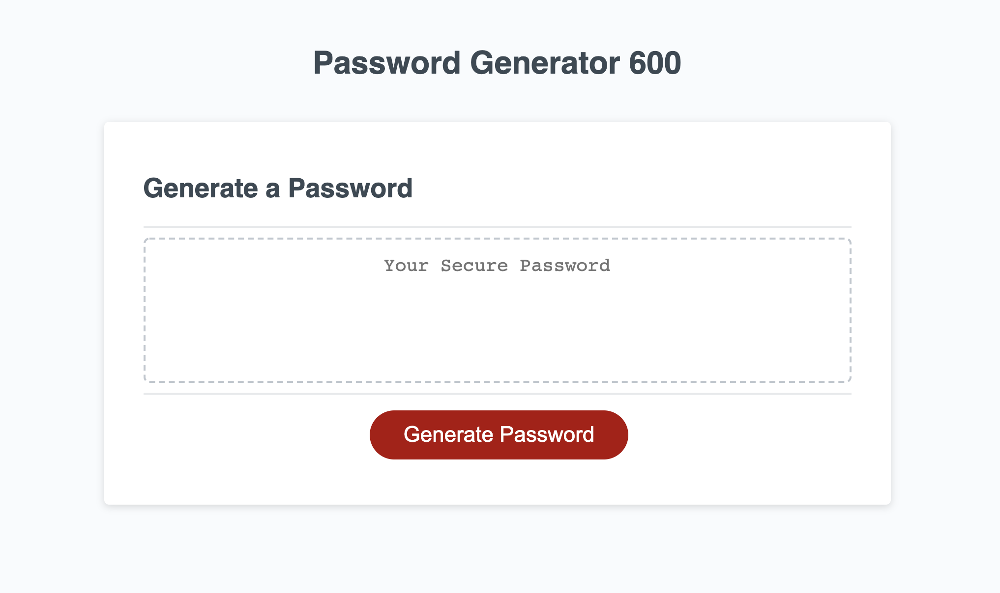

# password-generator-600
https://tforde4623.github.io/password-generator-600/

A password generator. (600 sounds cool, but not too cool)

An objected oriented approach, on what could have been some easily hardcoded if else statements and loops. This way, no matter what is put in as an data type object (as long as they follow the same structure) the generatePassword function will surely be able to include it in the final password, as opposed to needing to then change a bunch of lines in the main function to incorporate change in what should/shouldnt be included in the option of characters. I also found it pretty cool and learned a lot while making this.

